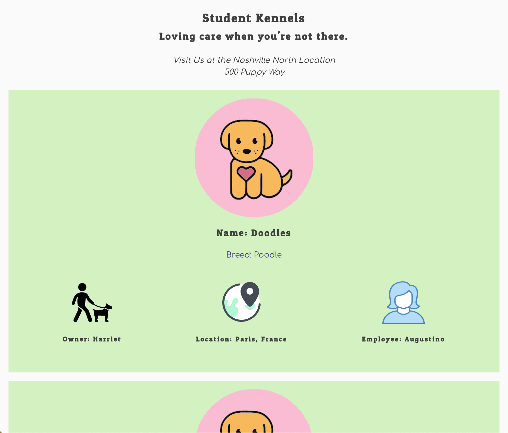

# Student Kennels

This project was bootstrapped with [Create React App](https://github.com/facebook/create-react-app).

## Project

This project had me building a single-page, dynamic React application for a student-run pet kennel. There is complete CRUD functionality allowing you to add, edit, and delete pets, owners, employees, and kennel locations.

You can only view detailed information like pets, owners, and employees if you are logged in.

Pets are input in the database with both an associated owner and employee.
